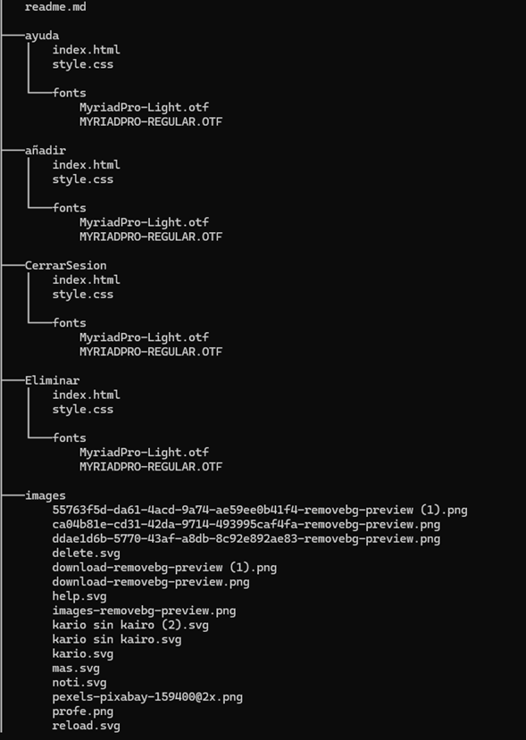
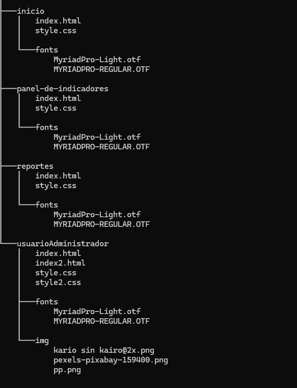

# kario Media

En este repositorio encontrarás la continuación del proyecto de desarrollo de un aplicativo web que muestra el panel de gestionamiento de proyectos y sus módulos necesarios para la empresa Kario Media **que realiza licitaciones públicas y privadas de varios nichos de negocio**. Mi grupo de trabajo cumplió con las partes acordadas y se terminó exitosamente este proyecto con la réplica propuesta  por parte del equipo IU/UX.

**Páginas para replicar:**

1. Panel de indicadores
2. Login de inicio

**Páginas para hacer:**
1. Añadir
2. Eliminar
3. Reportar
4. Ayuda
5. Perfil (Log-In y Log-Out)

## Descripción
El proyecto se divide en 6 partes:

1.	**Añadir:** Formulario para agregar más indicadores al panel.
2.	**Refrescar:** Panel de indicadores 
3.	**Eliminar:** Borrar indicadores del panel.
4.	**Reportar:** Reportar indicadores del panel.
5.	**Ayuda:** Aclarar las dudas del usuario de cómo usar (Añadir, Eliminar, Reportar)
6.	**Perfil:** cuenta del usuario administrador.

## Estructura del proyecto

El proyecto se encuentra dividido en carpetas con el nombre de cada parte de página y dentro de ella se encuentra los archivos como:

1.	**Index.html:** Archivo principal de nuestra página web.
2.	**Style.css:** Contiene los estilos de esta página web.
3.	Fonts:  Tipos de fuentes usadas en esta página web.
4.	**Images:** Contiene las imágenes usadas en la página web.
5.	**Readme.md:** Información de la estructura de la página web. 

## Características del diseño
1.	**Responsivo:** vw (viewport width) se usó este tipo de medida para adaptar la página web en un dispositivo móvil. 
2.	**Menú hamburguesa:**  Este menú solo está a la vista de un dispositivo móvil.
3.	**Imágenes:** imágenes como el logo, iconos del menú e iconos de datos personales en la parte del perfil del usuario administrador.
4.	**Fuentes personalizadas:** la página cuenta con 2 tpos de fuentes personalizadas.

## Tecnologias utilizadas

1.	HTML5
2.	CSS3
3.	**Tipos de fuentes:** Myriad pro Light,  Myriad pro Regular

## Instrucciones de uso:
Clona este repositorio o descarga los archivos que se encuentran dentro de las carpetas. Busca un navegador que sea compatible y abre el archivo *index.html.*

## Créditos 
La continuación del proyecto *kario Media* fue realizada por **Luis Miguel Caicedo Bermon** y **Valerie Michel Lasso Lizcano** para la entrega del proyecto filtro HTML y CSS.

